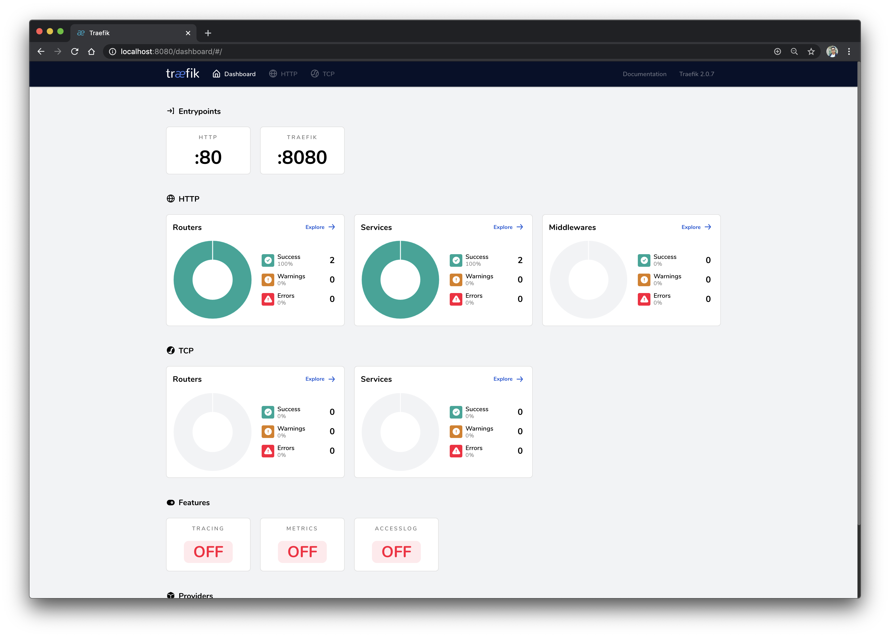
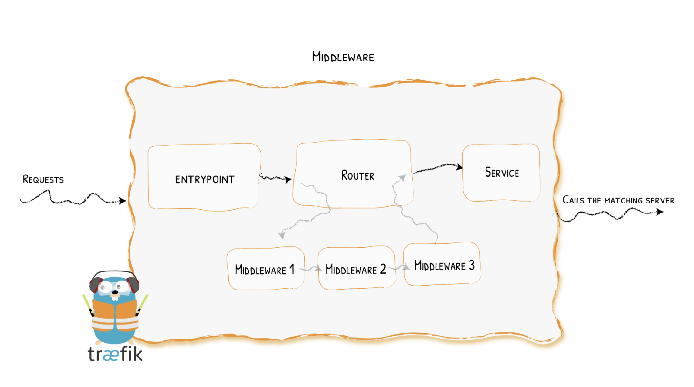
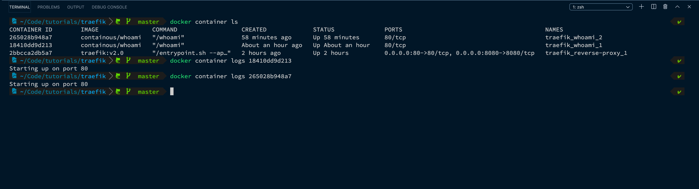
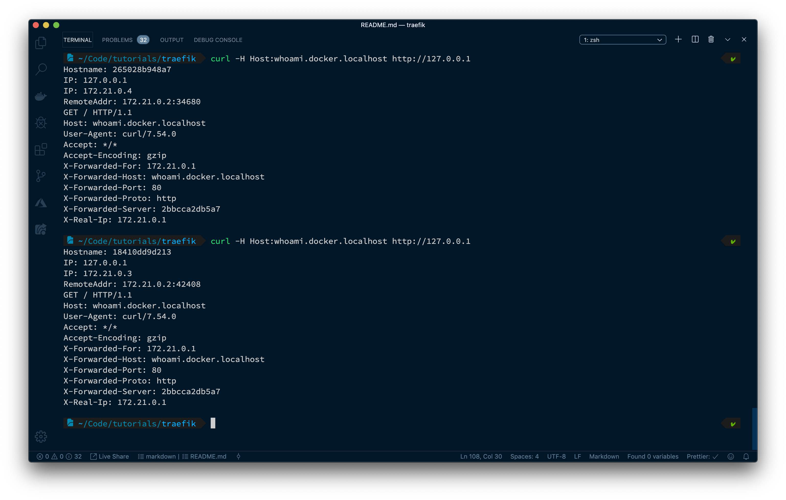

# Traefik Quickstart

Create a `docker-compose.yml` in your project root.

```
touch docker-compose.yml
```

Add the following:

```yml
version: "3"

services:
  reverse-proxy:
    # The official v2.0 Traefik docker image
    image: traefik:v2.0
    # Enables the web UI and tells Traefik to listen to docker
    command: --api.insecure=true --providers.docker
    ports:
      # The HTTP port
      - "80:80"
      # The Web UI (enabled by --api.insecure=true)
      - "8080:8080"
    volumes:
      # So that Traefik can listen to the Docker events
      - /var/run/docker.sock:/var/run/docker.sock
```

Start your `reverse-proxy` with the following command:

```
docker-compose up -d reverse-proxy
```

`docker-compose up` builds and starts a container for the reverse-proxy service.

`-d` enables detached mode, to run the container in the background, instead of the foreground.

You can open a browser and go to http://localhost:8080/api/rawdata to see Traefik's API rawdata. The json output should be similar to this:

```json
{
  "routers": {
    "reverse-proxy-traefik@docker": {
      "service": "reverse-proxy-traefik",
      "rule": "Host(`reverse-proxy-traefik`)",
      "status": "enabled",
      "using": ["http", "traefik"]
    }
  },
  "services": {
    "reverse-proxy-traefik@docker": {
      "loadBalancer": {
        "servers": [
          {
            "url": "http://172.21.0.2:80"
          }
        ],
        "passHostHeader": true
      },
      "status": "enabled",
      "usedBy": ["reverse-proxy-traefik@docker"],
      "serverStatus": {
        "http://172.21.0.2:80": "UP"
      }
    }
  }
}
```

This data can be reached because we specified `--api.insecure=true` in the docker-compose file, which exposes Traefik's API.
`--providers.docker` tells Traefik we want to use docker as a provider, but in order for Traefik to be able to listen to the Docker events, we need to attach to the docker daemon.

We do this in the docker-compose file by specifying:

```
volumes:
    - /var/run/docker.sock:/var/run/docker.sock
```

**Note:** `--api.insecure=true` should not be used in production. It's only for demonstration purposes. It allows you to see what goes on behind the scenes.

In production, you usually won't interact with the Traefik API directly. Instead you will interact with the WebUI, accessible here: http://localhost:8080



# What are routers anyway?

A router is in charge of connecting incoming requests to the services that can handle them. In the process, routers may use pieces of middleware to update the request, or act before forwarding the request to the service.

[docs: routers](https://docs.traefik.io/routing/routers/)

# What about services?

Services are responsible for configuring how to reach the actual services that will eventually handle the incoming requests.

[docs: services](https://docs.traefik.io/routing/services/)

# Middlewares?

Attached to the routers, pieces of middleware are a mean of tweaking the requests before they are sent to your service (or before the answer from the services are sent to the clients).

There are many different available middlewares in Traefik, some can modify the request, the headers, some are in charge of redirections, some add authentication, and so on.

[docs: middlewares](https://docs.traefik.io/middlewares/overview/)



## Traefik Detects New Services and Creates the Route for You

Now that we have a Traefik instance up and running, we will deploy new services.

Edit your docker-compose.yml file, replace its contents with this updated version:

```yml
version: "3"

services:
  reverse-proxy:
    # The official v2.0 Traefik docker image
    image: traefik:v2.0
    # Enables the web UI and tells Traefik to listen to docker
    command: --api.insecure=true --providers.docker
    ports:
      # The HTTP port
      - "80:80"
      # The Web UI (enabled by --api.insecure=true)
      - "8080:8080"
    volumes:
      # So that Traefik can listen to the Docker events
      - /var/run/docker.sock:/var/run/docker.sock

  whoami:
    # A container that exposes an API to show its IP address
    image: containous/whoami
    labels:
      - "traefik.http.routers.whoami.rule=Host(`whoami.docker.localhost`)"
```

The above defines whoami: a simple web service that outputs information about the machine it is deployed on (its IP address, host, and so on).

Start the whoami service with the following command:

```
docker-compose up -d whoami
```

Go back to your browser (http://localhost:8080/api/rawdata) and see that Traefik has automatically detected the new container and updated its own configuration. Now, the json output should similar to this:

```json
{
  "routers": {
    "reverse-proxy-traefik@docker": {
      "service": "reverse-proxy-traefik",
      "rule": "Host(`reverse-proxy-traefik`)",
      "status": "enabled",
      "using": ["http", "traefik"]
    },
    "whoami@docker": {
      "service": "whoami-traefik",
      "rule": "Host(`whoami.docker.localhost`)",
      "status": "enabled",
      "using": ["http", "traefik"]
    }
  },
  "services": {
    "reverse-proxy-traefik@docker": {
      "loadBalancer": {
        "servers": [
          {
            "url": "http://172.21.0.2:80"
          }
        ],
        "passHostHeader": true
      },
      "status": "enabled",
      "usedBy": ["reverse-proxy-traefik@docker"],
      "serverStatus": {
        "http://172.21.0.2:80": "UP"
      }
    },
    "whoami-traefik@docker": {
      "loadBalancer": {
        "servers": [
          {
            "url": "http://172.21.0.3:80"
          }
        ],
        "passHostHeader": true
      },
      "status": "enabled",
      "usedBy": ["whoami@docker"],
      "serverStatus": {
        "http://172.21.0.3:80": "UP"
      }
    }
  }
}
```

Notice the additional router and service for `whoami`.

When Traefik detects new services, it creates the corresponding routes so you can call them ... let's see! (Here, we're using curl)

```
curl -H Host:whoami.docker.localhost http://127.0.0.1
```

## More Instances? Traefik Load Balances Them

Run more instances of your whoami service with the following command:

```
docker-compose up -d --scale whoami=2
```

Make sure your containers are running without errors. Print a list of the containers on your machine, then grab their container ids to inspect the container logs.

```
docker container ls
docker container logs <container_id>
```



Go back to your browser (http://localhost:8080/api/rawdata) and see that Traefik has automatically detected the new instance of the container. Once again, the json output should have changed to look like this:

```json
{
  "routers": {
    "reverse-proxy-traefik@docker": {
      "service": "reverse-proxy-traefik",
      "rule": "Host(`reverse-proxy-traefik`)",
      "status": "enabled",
      "using": ["http", "traefik"]
    },
    "whoami@docker": {
      "service": "whoami-traefik",
      "rule": "Host(`whoami.docker.localhost`)",
      "status": "enabled",
      "using": ["http", "traefik"]
    }
  },
  "services": {
    "reverse-proxy-traefik@docker": {
      "loadBalancer": {
        "servers": [
          {
            "url": "http://172.21.0.2:80"
          }
        ],
        "passHostHeader": true
      },
      "status": "enabled",
      "usedBy": ["reverse-proxy-traefik@docker"],
      "serverStatus": {
        "http://172.21.0.2:80": "UP"
      }
    },
    "whoami-traefik@docker": {
      "loadBalancer": {
        "servers": [
          {
            "url": "http://172.21.0.3:80"
          },
          {
            "url": "http://172.21.0.4:80"
          }
        ],
        "passHostHeader": true
      },
      "status": "enabled",
      "usedBy": ["whoami@docker"],
      "serverStatus": {
        "http://172.21.0.3:80": "UP",
        "http://172.21.0.4:80": "UP"
      }
    }
  }
}
```

Finally, see that Traefik load-balances between the two instances of your service by running the following command twice:

```
curl -H Host:whoami.docker.localhost http://127.0.0.1
```

Every time you re-run the curl command above the load balancer will alternate between the two server IP addresses.


